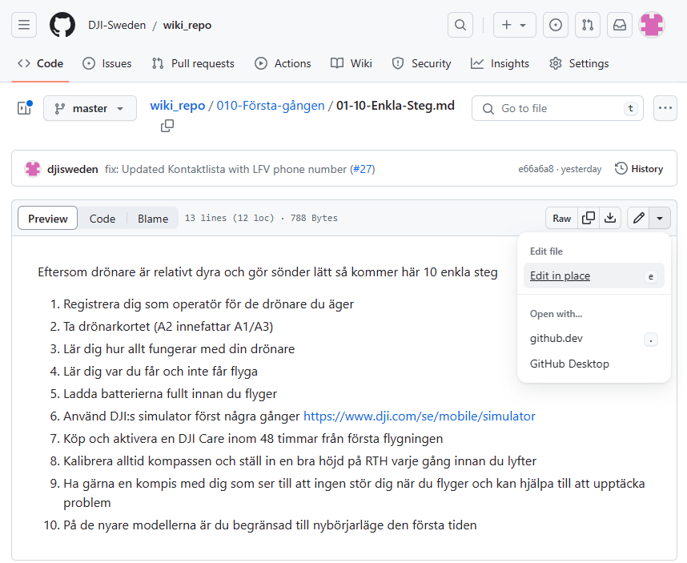
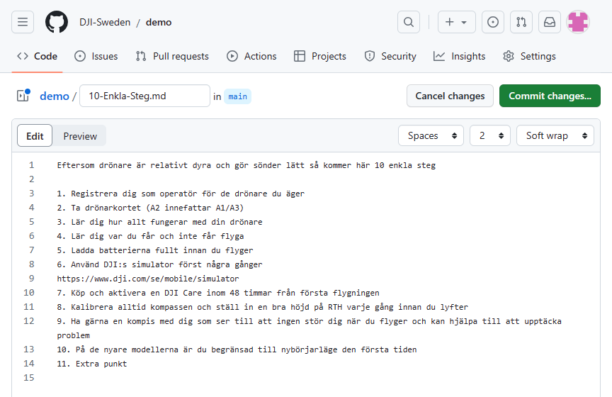
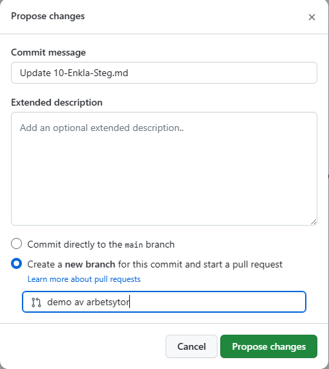
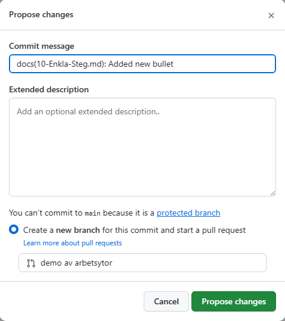

Du kan göra ändringar direkt i GitHub vilket sparar ett antal steg.

1. ~~Synka ner aktuell publicerad version~~
2. Skapa en egen arbetsyta
3. ~~Spara status och synka regelbundet~~
4. Begär en granskning
5. Publicera arbetsytan
6. ~~Radera arbetytan~~

Vilket i praktiken blir

1. Skapa/ändra en fil
2. Spara filen i en arbetsyta
3. Begär en granskning
4. Publicera ändringen

## 2. Skapa en egen arbetsyta

Navigera till filen som du vill ändra i och välj `Edit in place (e)`

Du kan skapa en arbetsyta separat först, men det är enklare att göra det valet när du gör din första snapshot med `Commit Changes...`

Notera att det inte finns något val att använda main när den är spärrad.

Ändra titel på din arbetsyta till något beskrivande för `Create a new branch`.

Ändra ditt `Commit Message` i enlighet med `Conventional Commits`.

Klicka på `Propose changes`

## 3. Begär en granskning

Om detta var den enda ändringen du ville göra kan du nu [Skapa en Pull Request](./Skapa-en-Pull-Request.md).  
När `Pull Requesten` gått igenom och din arbetsyta slagits ihop med main/master, kommer den att raderas automatiskt då den inte längre behövs.

I annat fall fortsätter du ditt arbete i din arbetsyta.  
Du kan göra ändringarn även efter att en request påbörjats för att snabbt göra rättningar och ändringar utifrån de kommentarer som kan uppkomma.
