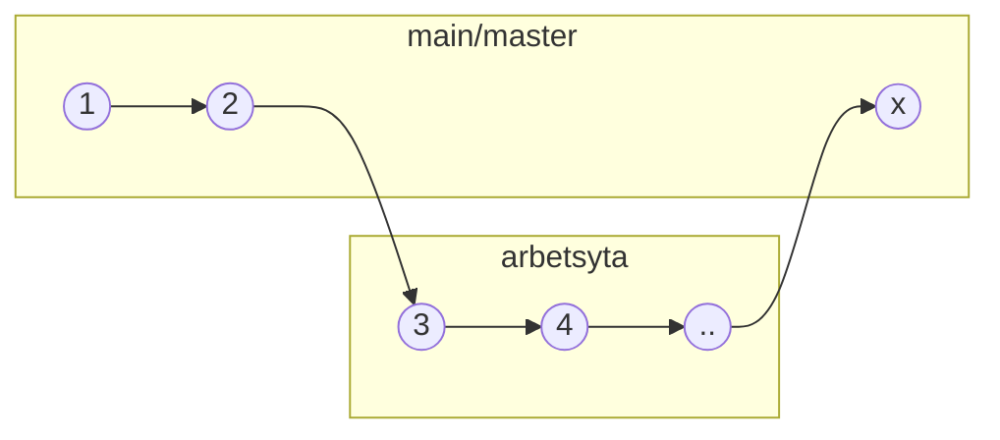
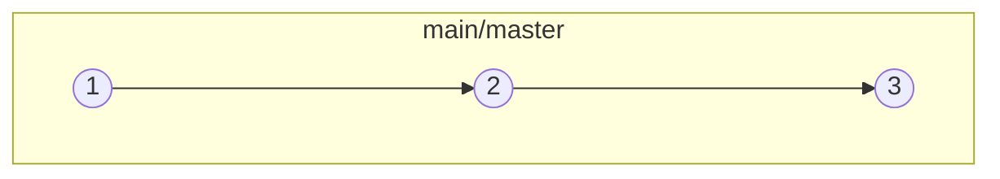

## Välkommen till en ny värld

Git är det överlägset mest använda sättet att arbeta seriöst med revisionshantering i team där text är det huvudsakliga mediat.

### Hur fungerar det?

Med Git sätter du upp en samling av filer i ett sk. repository. 

Detta är en vanlig filkatalog som dessutom innehåller lite konfigurationer som Git behöver.

~~~
/.git
/file1
/subfolder_1/file2
/subfolder_2/file3
...
~~~

Med ett repo kan du:

* Arbeta off-line
* Synka mot en remote
* Arbeta med ändringar sidan om 
* Göra snapshot på hela repot
* Gå tillbaka till tidigare snapshots
* Få ändringar granskade innan publicering
* Se sammanfattningar av snapshots i en log
* mm.

### Snapshots (Commit)

När du arbetat ett tag med ditt repo kommer du till ett läge som du kan tänka dig att kunna återgå till.

I Git gör man en snapshot med `Commit` tillsammans med ett meddelande om vad man gjort.

I en snapshot tar man normalt med alla filer som ändrats, lagts till eller raderats sedan förra snapshoten.

För att enkelt kunna läsa snapshotloggarna är det vanligt att man skriver sitt `Commit Message` på ett speciellt sätt

~~~
typ(referens): Vad jag gjort
~~~~ 

Typerna som ofta används är:

* docs - Arbete med dokument
* fix - Någon typ av rättning
* refact - Omskrivning som inte påverkar mening
* chore - Allmänt arbete som inte påverkar innehållet
* revert - Återgång till tidigare snapshot

Referens används om man vill hänvisa till t.ex. ett ärendedummer eller kanske den sektion som ändringen gjorts i etc.

Exempel: 
```
docs: Added "Att byta batteri"
```

Det finns ett antal typer till som används vid programmering (se [Conventional Commits](https://cheatography.com/albelop/cheat-sheets/conventional-commits/)).

### Gitserver

Ditt repo delar du remote via en Gitserver såsom GitHub. Därifrån kan andra använda ditt repo genom att ladda ner det lokalt till sig själv.

### Arbetsflöde

Arbetsflödet i Git är oftast:

1. Synka ner aktuell publicerad version
1. Skapa en egen arbetsyta
1. Spara status och synka regelbundet
1. Begär en granskning när det är klart
1. Publicera arbetsytan
1. Radera arbetytan

Det går att använda mycket mer komplicerade flöden, men enklast är oftast bäst.

För att hålla koll på alla ändringar som görs, signeras varje sammantagen differens mot föregående snapshot med en checksumma i en obrytbar länkkjedja. Så det går inte att ändra i historiken och smyga in saker i efterhand.

### Arbetsytor (Branch)

Eftersom alla har varsitt original av repositoriet, brukar man spärra återsynkning av publiceringen (master/main) på GitServern för att undvika konflikter (vems original är det annars som gäller?). 

Så istället för att arbeta med main/master i sitt repo, är ett vanligt sätt att skapa en separat arbetsyta. Där går det att hålla sitt arbete helt sidan om tills det är redo för publicering.

### Innan publicering



### Efter publicering



Istället för en återsynk mot main/master begär man istället en röstning om det som finns i arbetsytan ska med i den nya publiceringen.

### Vanliga tankevurpor

Det som kan förvirra i början är att Git

* är en "distribuerad multipel master" lösning  
dvs. alla har ett eget komplett original tillgängligt lokalt
* i råform används "konstiga" Linux kommandon  
detta går att förenkla med olika hjälpmedel
* inte visar vad "nästa steg" i arbetsflödet är  
du måste själv ha råkoll på stegen
* inte vet vilken status övriga lokala original är i  
du måste synka ditt original ofta via en remote repo som GitHub
* kan inte radera en tidigare inlänkade snapshot  
har du fått med känslig info av misstag kan det bli lite jobbigt
* kan inte veta om remote main är spärrad  
det upptäcker Git inte förrän du försöker göra en återsynk om du glömt bort det
* ändringar som inte ingår i en snapshot flyter  
om du byter arbetsyta så följer alla ändringar med när du byter arbetsyta och inte gjort en snapshot först
