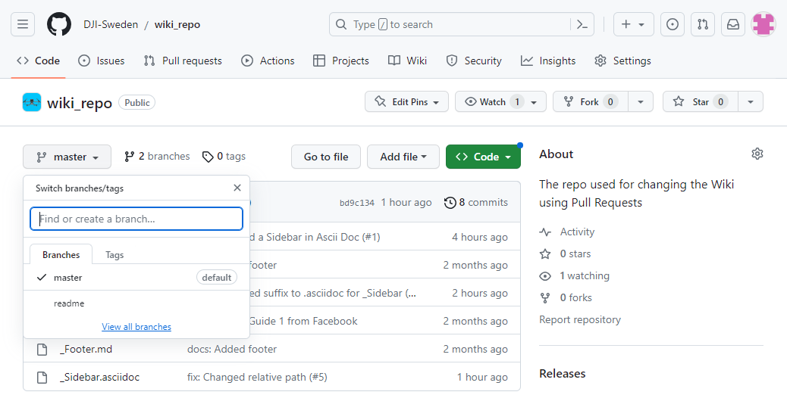
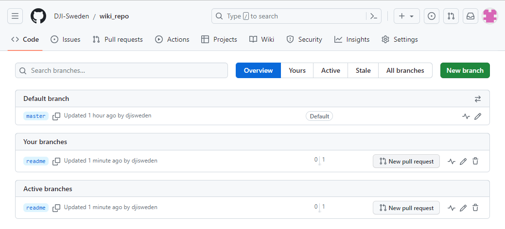
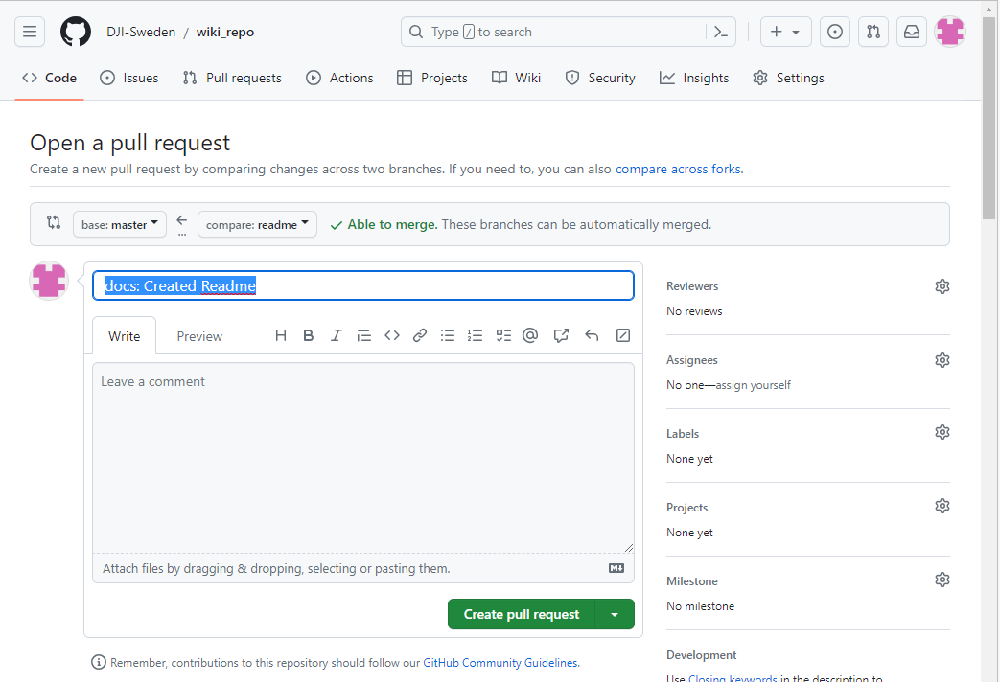

Granskning och Publicering i GitHub görs med något som kallas 'Pull Request'.

När du är klar med ditt arbete i din arbetsyta och synkat upp den så letar du upp din arbetsyta (brancher) med `View all branches`

och klickar på `New pull request`

Fyll i en kort men beskrivande titel

och klicka på `Create pull request`.

När föreslagen ändring granskats av `Reviewer` kan sedan den som ansvarar för detta repot genomföra en `Merge` till huvudspåret `master`.

Detta görs normalt med `Squash and merge` så att alla små commits i arbetsytan slås ihop till en enda.