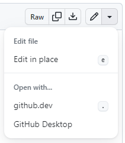
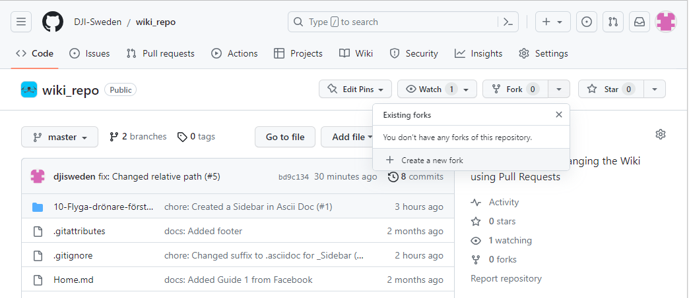
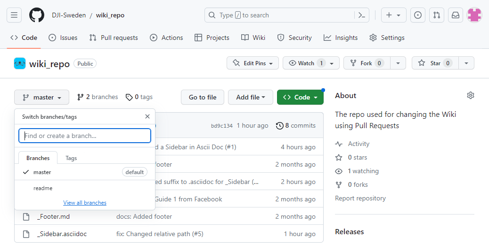
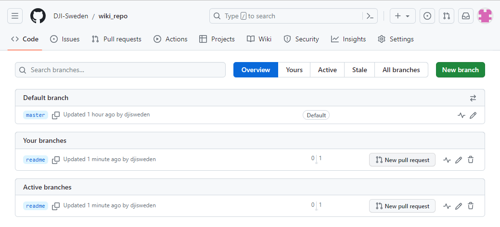
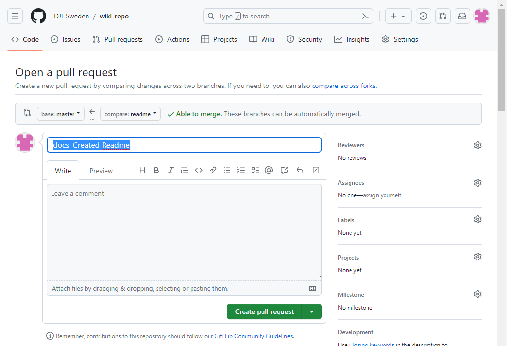

# DJI Sweden - Wiki

## 1. Beskrivning

Detta är innehållet för DJI Sweden Wiki. 

Uppdateringar görs här för att kunna använda den versionshantering som tillhandahålls med Git.  
Eftersom Wikis på GitHub inte presenteras som ett vanligt repo används denna "sido-klon" för att ändringar ska gå att hantera innan de publiceras till DJI Sweden Wiki på riktigt. 

## 2. Krav för användning

Du behöver:
* ett konto på GitHub
* installera Git for Windows (om du kör Windows)
* kunna (lära dig) Git
* kunna (lära dig) skriva i Markdown
* installera en Markdown-editor (om du vill se pre-views)
* förstå hur GitHub "plattar ut" filstrukturer i sina Wikis
* förstå relativ länkning

## 3. Användning/Hur gör jag

Till att börja med kan använda GitHubs webgui eller använda `GitHub Desktop` för att gära ändringar.  

WebGUI:t finns i två varianter:

* Edit in Place
* github.dev

`github.dev` är en komplett webversion av `VS Code`, men den saknar stöd för många Extensions.

För mer omfattande ändringar med full kontroll är det bäst att arbeta med en lokal klon och ett rent Git-verktyg.  

Men `GitHub Desktop` bör fungera bra för ditt behov.

#### 3.1 Ladda ner repot

Om du inte ingår i DJI Swedens wiki-team måste du skapa en `Fork` till ditt eget GitHub-konto med `Fork - + Create a new fork`

Sedan kopierar du ner hela wiki-repot till din egen maskin med kommandot

`git clone https://GitHub.com/DJI-Sweden/wiki_repo.git`

Byt ut URL mot din egen `fork` om du använder en sådan.

#### 3.2 Skapa en lokal arbetsyta

Eftersom huvudspåret `master` är uppsatt på GitHub med krav på granskning kan du inte skicka upp ändringar du gjort lokalt direkt. Du måste istället skapa en egen arbetsyta (branch).

Innan du skapar en ny arbetsyta måste du försäkra dig om att ditt lokala repo är upp to date med kommandot

`git pull`

Sedan kan du skapa din arbetsyta

`git checkout -b <arbetsnamn>`

Synka sedan upp din arbetsyta till GitHub

`git push --set-upstream origin <arbetsnamn>`

#### 3.3 Skapa återställningspunkter

Du kan spara din status i din lokala arbetsyta genom att göra `commits`.

`git add .`  
`git commit -m'<beskriv typ av ändring>'`

#### 3.4 Synka din arbetsyta med GitHub

Din arbetsarea synkar du sedan till GitHub med

`git push`

Ta som vana att göra detta direkt efter du sparat status för din Git (`commit`) så har du alltid en aktuell version på GitHub.

Synken tar bara med det som du gjort `commit` på.

#### 3.5 Begär en granskning

När du är klar med ditt arbete i din arbetsyta och synkat upp den så letar du upp din arbetsyta (brancher) med `View all branches`

och klickar på `New pull request`

Fyll i en kort men beskrivande titel

och klicka på `Create pull request`.

När föreslagen ändring granskats av `Reviewer` kan sedan den som ansvarar för detta repot genomföra en `Merge` till huvudspåret `master`.

Detta görs normalt med `Squash and merge` så att alla små commits i arbetsytan slås ihop till en enda.

#### 3.6 Synka till DJI Sweden Wiki

Ingen ändring kommer att synas förrän ansvarig för DJI Sweden Wiki synkar detta repo med det som används av Wikin på GitHub.

## 4. Referenslista och länkar

* [Git for Windows](https://git-scm.com/download/win)
* [GitHub Desktop](https://desktop.github.com/)
* [Git and GitHub Introduction](https://www.w3schools.com/git/git_intro.asp?remote=github)
* [GitHub Wiki - Howto](https://gist.github.com/subfuzion/0d3f19c4f780a7d75ba2)
* [Getting started with Markdown](https://www.markdownguide.org/getting-started/)
* [Zettlr](https://www.zettlr.com/download)
* [Visual Studio Code](https://code.visualstudio.com/download)
  * [Extension - Paste Image](https://marketplace.visualstudio.com/items?itemName=mushan.vscode-paste-image)
  * [Extension - Git Graph](https://marketplace.visualstudio.com/items?itemName=mhutchie.git-graph)

## 5. Kontakter

* Om du har frågor kring hur detta fungerar så ta kontakt med någon admin på Facebook i gruppen [DJI Sweden](https://www.facebook.com/groups/djisweden).
